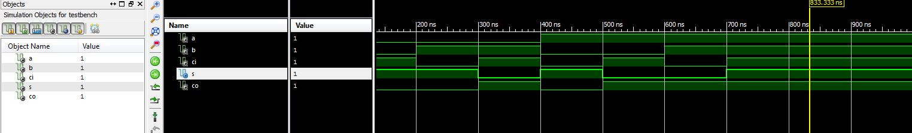

ECE281_Lab2
==========
# C3C Sung Woo Suh

# Truth Table and Schematic

# VHDL
https://github.com/suhsungwoo/Lab2/blob/master/Full_Adder.vhd

# Test bench
 https://github.com/suhsungwoo/Lab2/blob/master/Testbench.vhd
 
# Test bench output

