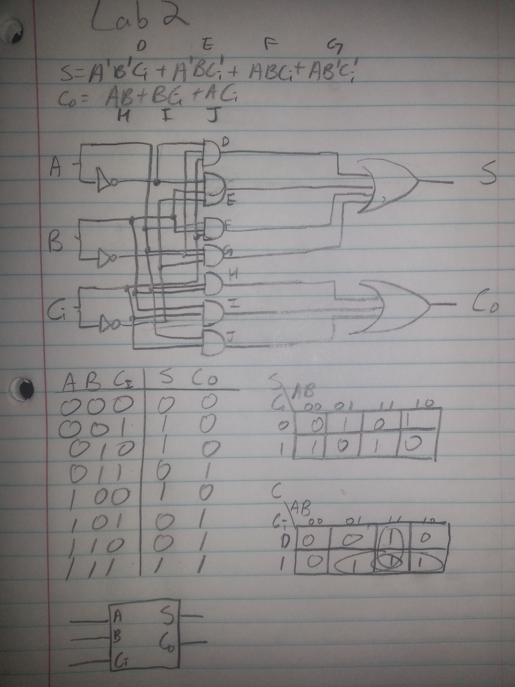
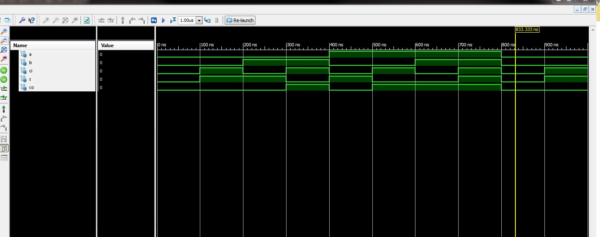
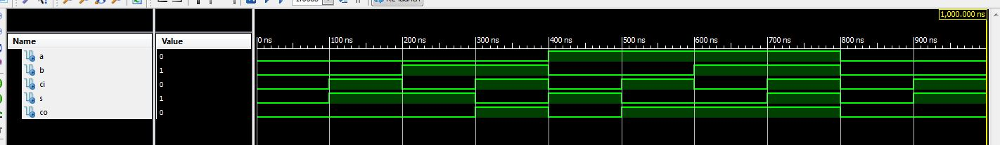

ECE281_Lab2
==========
# C3C Sung Woo Suh

## Truth Table and Schematic

## VHDL
https://github.com/suhsungwoo/Lab2/blob/master/full_adder.vhd

## Test bench
 https://github.com/suhsungwoo/Lab2/blob/master/full_adder_tb.vhd
 
## Test bench output

## 4 bit adder testbench
https://github.com/suhsungwoo/Lab2/blob/master/four_bit_adder_tb.vhd

## 4 bit adder VHDL
https://github.com/suhsungwoo/Lab2/blob/master/four_bit.vhd

## 4 bit implementation .ucf file
https://github.com/suhsungwoo/Lab2/blob/master/four_bit_implementation.ucf

## 4 bit adder Testbench output

## documentation:
C3C Kiernan helped me with the K-map and in the test bench.

